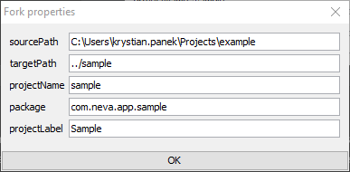

[](http://www.apache.org/licenses/)
[](https://github.com/neva-dev/gradle-fork-plugin/stargazers)

# Gradle Fork Plugin

## Description

**Project generator based on live archetypes** (example projects).

Newcomers of Gradle Build System very often complain about that in Gradle there is no Maven's archetype like mechanism OOTB. This plugin tries to fill that gap.

**Assumptions**

  * Instead of creating a virtual project aka Maven Archetype with placeholders, plugin allows to treat any existing project like a base for a new project.
  * It is easier to copy rich example project and remove redundant things than creating project from archetype and looking for missing things.
  * From business perspective, plugin allows to automate rebranding at code level (perform massive renaming, repackaging).
  * Maintenance of real / working example projects is probably easier than maintaining archetypes (there is no need to regenerate project every time to prove that archetype is working properly).

## Table of Contents

* [Usage](#usage)
   * [Sample build script](#sample-build-script)
   * [Defining and executing configurations](#defining-and-executing-configurations)
   * [Providing properties](#providing-properties)
   * [Sample output](#sample-output)
* [License](#license)

## Usage

### Sample build script

```groovy
buildscript {
  repositories {
      jcenter()
      maven { url  "https://dl.bintray.com/neva-dev/maven-public" }
  }
  dependencies {
      classpath 'com.neva.gradle:fork-plugin:1.0.0'
  }
}

apply plugin: 'com.neva.fork'

fork {
    config {
        cloneFiles()
        moveFiles([
                "/example": "/{{projectName}}"
        ])
        replaceContents([
                "com.company.app.example": "{{package}}",
                "example": "{{projectName}}",
                "Example": "{{projectLabel}}"
        ])
        copyTemplateFile("gradle.properties")
    }
}
```

### Defining and executing configurations

Fork configuration will:

* Copy all project files respecting filtering defined in *.gitignore* files.
* Rename directories using rules with properties injecting.
* Replace contents using rules with properties injecting.
* Generate from template a file containing user specific properties (like repository credentials etc).

To execute default configuration, run command:

```bash
sh gradlew fork
```

### Providing properties

Properties can be provided by (order makes precedence):
 
1. File which path could be specified as command line parameter:

    ```bash
    sh gradlew fork -Pfork.properties=fork.properties
    ```
    
    Such file should be in format:
    
    ```bash
    targetPath=../sample
    projectName=sample
    projectLabel=Sample
    package=com.neva.app.sample
    ```
  
2. Each property defined separately as command line parameter:

    ```bash
    sh gradlew fork -PprojectName=sample -PprojectLabel=Sample -PtargetPath=../sample -Ppackage=com.neva.app.sample
    ```

3. GUI / properties dialog

    
    
    This dialog is always displayed to allow amending values provided by command line or properties file.
    
    To disable it, use command line parameter:
    
    ```bash
    sh gradlew fork -Pfork.interactive=false
    ```
  
4. Mixed approach.

### Sample output

As a fork result, there will be a cloned project with correctly changed directory names, with replaced project name and label in text files (all stuff being previously performed manually).

<pre>
Cloning files from C:\Users\krystian.panek\Projects\example to ..\sample
Copying file from C:\Users\krystian.panek\Projects\example\.editorconfig to ..\sample\.editorconfig
...
Moving file from C:\Users\krystian.panek\Projects\example\apps\example\content.xml to ..\sample\apps\sample\content.xml
...
Replacing 'Example' with 'Sample' in file C:\Users\krystian.panek\Projects\sample\app\build.gradle
Replacing 'com.company.aem.example' with 'com.neva.aem.sample' in file C:\Users\krystian.panek\Projects\sample\app\common\build.gradle
Replacing 'example' with 'sample' in file C:\Users\krystian.panek\Projects\sample\app\common\src\main\content\META-INF\vault\filter.xml
...
Copying file from C:\Users\krystian.panek\Projects\example\gradle\fork\gradle.properties to ..\sample\gradle.properties
Expanding properties in file ..\sample\gradle.properties
</pre>

## License

**Gradle Fork Plugin** is licensed under the [Apache License, Version 2.0 (the "License")](https://www.apache.org/licenses/LICENSE-2.0.txt)

